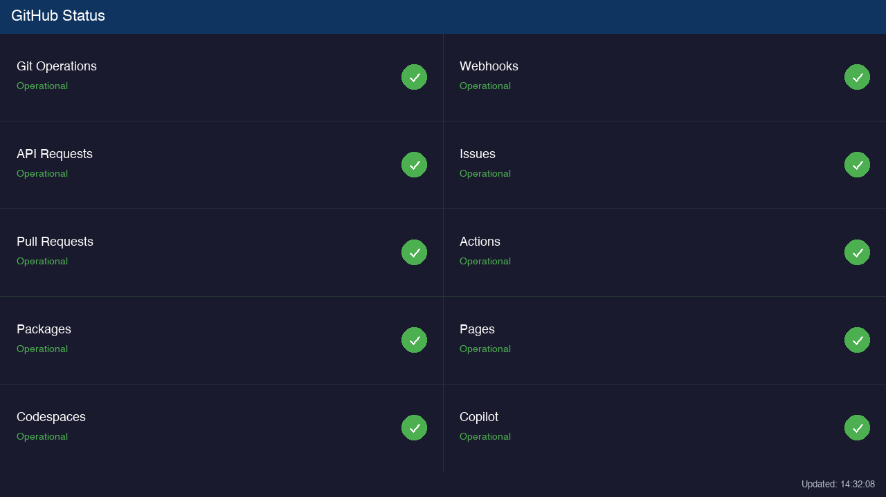
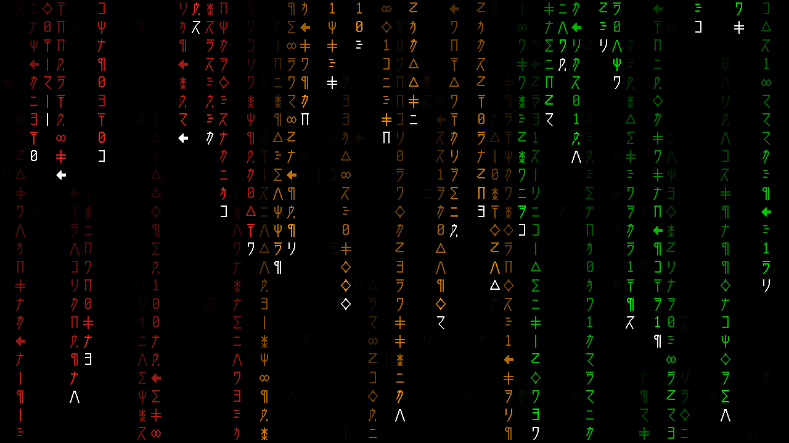

# Tab5GitHubStatus

A real-time GitHub service status dashboard for the **M5Stack Tab5** (1280×720 IPS touchscreen), built with the [Tab5UI](https://github.com/mcherry/Tab5UI) library.

## Screenshots

### Status Dashboard


### Matrix Screensaver


## Features

- **Live status grid** — Displays 10 GitHub service components (Git Operations, Webhooks, API Requests, Issues, Pull Requests, Actions, Packages, Pages, Codespaces, Copilot) in a 2×5 grid layout
- **Color-coded indicators** — Green (Operational), Orange (Degraded/Partial Outage), Red (Major Outage) circle icons with status text
- **Auto-refresh** — Status updates every **2 minutes** from the [GitHub Status API](https://www.githubstatus.com/api/v2/components.json)
- **Matrix screensaver** — A scrolling Matrix-style code rain screensaver activates after **5 minutes** of no touch interaction
- **Display sleep** — The screen turns off after **8 hours** of inactivity to save power

## Screensaver Behavior

The Matrix screensaver activates after 5 minutes of no touchscreen interaction. It will **only exit** when:

1. **The screen is touched** — Any touch immediately dismisses the screensaver and restores the status dashboard
2. **A component status changes** — If any GitHub service's status changes between refreshes (e.g., from Operational to Degraded, or vice versa), the screensaver exits automatically to display the updated status

Routine status refreshes where all statuses remain unchanged will **not** interrupt the screensaver.

## Configuration

Before uploading, edit the following constants at the top of `Tab5GitHubStatus.ino`:

### WiFi Credentials

```cpp
const char* WIFI_SSID = "WIFISSID";       // Your WiFi network name
const char* WIFI_PASS = "WIFIPASSWORD";    // Your WiFi password
```

### Timezone Offset

The status bar displays the last update time in local time. Configure your timezone by setting the GMT offset and daylight saving time offset:

```cpp
const long GMT_OFFSET_SEC      = -5 * 3600;   // UTC offset in seconds (e.g., -5 for EST)
const int  DAYLIGHT_OFFSET_SEC = 3600;         // DST offset in seconds (3600 for +1h, 0 for none)
```

Common examples:
| Timezone | `GMT_OFFSET_SEC` | `DAYLIGHT_OFFSET_SEC` |
|---|---|---|
| US Eastern (EST/EDT) | `-5 * 3600` | `3600` |
| US Central (CST/CDT) | `-6 * 3600` | `3600` |
| US Mountain (MST/MDT) | `-7 * 3600` | `3600` |
| US Pacific (PST/PDT) | `-8 * 3600` | `3600` |
| UTC | `0` | `0` |
| Central Europe (CET/CEST) | `1 * 3600` | `3600` |

## Required Libraries

| Library | Source |
|---|---|
| **M5GFX** | Arduino Library Manager |
| **ArduinoJson** (v7+) | Arduino Library Manager |
| **Tab5UI** | [GitHub](https://github.com/mcherry/Tab5UI) — install to `~/Documents/Arduino/libraries/` |

## Hardware

- **Board:** M5Stack Tab5
- **Display:** 5" 1280×720 IPS capacitive touchscreen (landscape orientation)

## Building & Uploading

1. Install the required libraries listed above
2. Open `Tab5GitHubStatus.ino` in the Arduino IDE
3. Set your WiFi credentials and timezone offset
4. Select the M5Stack Tab5 board
5. Upload

## License

This project is licensed under the GNU General Public License v3.0. See [LICENSE](LICENSE) for details.
